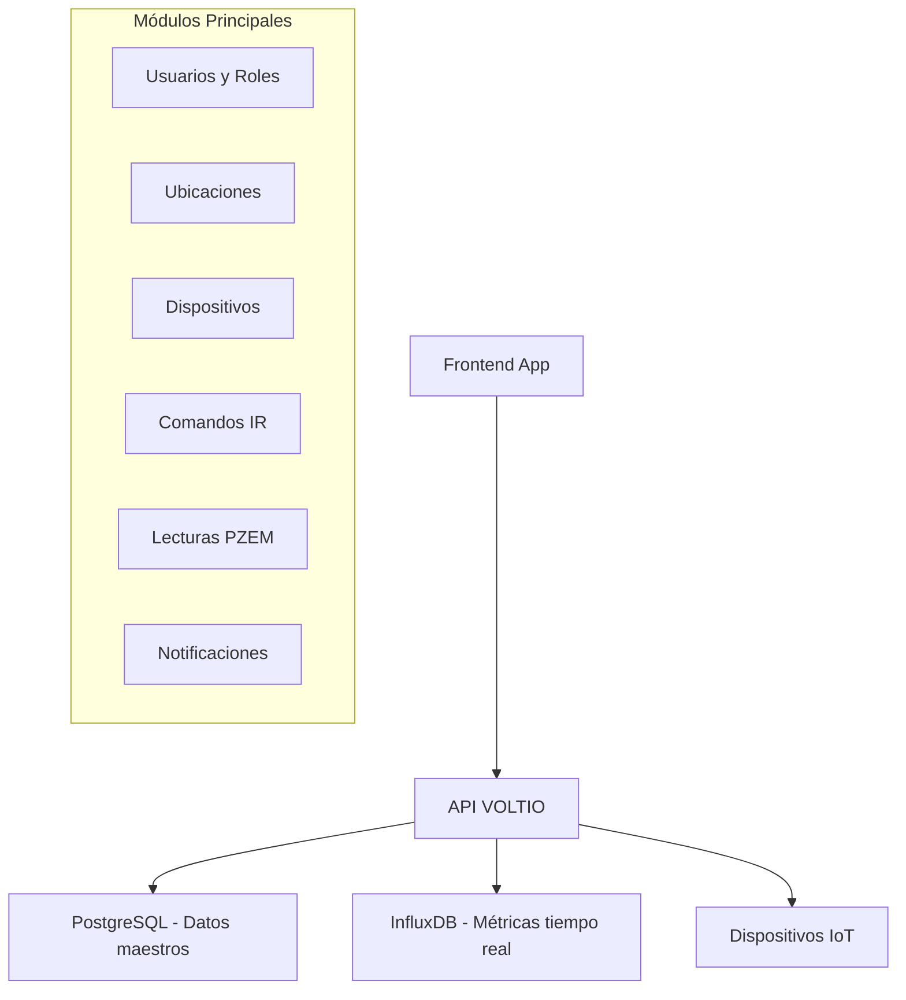

# 🚀 API VOLTIO - Guía Completa para Desarrolladores Frontend

## 📋 Tabla de Contenidos

1. [🎯 Introducción al Sistema](#-introducción-al-sistema)
2. [🔐 Autenticación y Autorización](#-autenticación-y-autorización)
3. [🌐 Información de Conexión](#-información-de-conexión)
4. [👥 Gestión de Usuarios](#-gestión-de-usuarios)
5. [🏷️ Sistema de Roles](#️-sistema-de-roles)
6. [📍 Gestión de Ubicaciones](#-gestión-de-ubicaciones)
7. [🔌 Tipos de Dispositivos](#-tipos-de-dispositivos)
8. [📱 Gestión de Dispositivos](#-gestión-de-dispositivos)
9. [🎮 Comandos de Dispositivos](#-comandos-de-dispositivos)
10. [📊 Lecturas y Métricas](#-lecturas-y-métricas)
11. [🔔 Sistema de Notificaciones](#-sistema-de-notificaciones)
12. [🧪 Endpoints de Monitoreo](#-endpoints-de-monitoreo)
13. [🔧 Endpoints de Debug](#-endpoints-de-debug)
14. [⚠️ Manejo de Errores](#️-manejo-de-errores)
15. [🎨 Ejemplos de Integración](#-ejemplos-de-integración)

---

## 🎯 Introducción al Sistema

### ¿Qué es API VOLTIO?

API VOLTIO es un sistema de **gestión de dispositivos IoT y monitoreo energético** que permite:

- **Gestión centralizada** de dispositivos inteligentes (sensores PZEM, dispositivos IR, etc.)
- **Monitoreo en tiempo real** de consumo energético y métricas eléctricas
- **Control remoto** de dispositivos mediante comandos IR
- **Sistema de alertas** y notificaciones automáticas
- **Gestión de usuarios** con diferentes niveles de acceso

### Arquitectura del Sistema



---

## 🔐 Autenticación y Autorización

### ¿Por qué necesitas autenticación?

El sistema maneja **datos sensibles** de dispositivos IoT y métricas energéticas, por lo que requiere autenticación JWT para:

- Proteger datos de consumo energético
- Controlar acceso a dispositivos
- Auditar acciones del usuario
- Segregar datos por organización

### Flujo de Autenticación

```javascript
// 1. Login del usuario
const loginResponse = await fetch("/api/v1/users/login", {
  method: "POST",
  headers: { "Content-Type": "application/json" },
  body: JSON.stringify({
    email: "usuario@empresa.com",
    password: "password123",
  }),
});

const { access_token, user } = await loginResponse.json();

// 2. Usar token en requests posteriores
const headers = {
  Authorization: `Bearer ${access_token}`,
  "Content-Type": "application/json",
};
```

### Niveles de Acceso

| Rol            | Permisos                           | Casos de Uso                  |
| -------------- | ---------------------------------- | ----------------------------- |
| **SuperAdmin** | Acceso completo                    | Administración del sistema    |
| **Admin**      | Gestión de usuarios y dispositivos | Administración organizacional |
| **User**       | Lectura de datos propios           | Monitoreo personal            |
| **Guest**      | Solo lectura limitada              | Visualización básica          |

---

## 🌐 Información de Conexión

### URLs Base

```javascript
const API_CONFIG = {
  production: "https://voltioapi.acstree.xyz/api/v1",
  development: "http://localhost:8000/api/v1",
};
```

### Configuración de Cliente

```javascript
class VoltioAPI {
  constructor(baseURL, token = null) {
    this.baseURL = baseURL;
    this.token = token;
    this.headers = {
      "Content-Type": "application/json",
      ...(token && { Authorization: `Bearer ${token}` }),
    };
  }

  async request(endpoint, options = {}) {
    const response = await fetch(`${this.baseURL}${endpoint}`, {
      headers: this.headers,
      ...options,
    });

    if (!response.ok) {
      throw new Error(`API Error: ${response.status}`);
    }

    return response.json();
  }
}
```

---

## 👥 Gestión de Usuarios

### ¿Por qué existe este módulo?

El sistema necesita **gestionar múltiples usuarios** con diferentes niveles de acceso para:

- Segregar datos por organización
- Controlar permisos de dispositivos
- Auditar acciones del sistema
- Permitir colaboración empresarial

### 🔓 Registro de Usuario Público

**¿Por qué es público?** Permite autoregistro de nuevos usuarios para facilitar la adopción.

```http
POST /users/register
Content-Type: application/json

{
    "username": "juanperez",
    "email": "juan@empresa.com",
    "password": "MiPassword123!",
    "role_id": 2
}
```

**Respuesta:**

```json
{
  "id": 123,
  "username": "juanperez",
  "email": "juan@empresa.com",
  "role_id": 2,
  "is_active": true,
  "created_at": "2025-07-22T15:30:00Z"
}
```

**Casos de uso Frontend:**

- Formulario de registro de nuevos usuarios
- Validación de email único
- Asignación automática de rol básico

### 🔐 Login de Usuario

```http
POST /users/login
Content-Type: application/json

{
    "email": "juan@empresa.com",
    "password": "MiPassword123!"
}
```

**Respuesta:**

```json
{
  "access_token": "eyJ0eXAiOiJKV1QiLCJhbGciOiJIUzI1NiJ9...",
  "token_type": "bearer",
  "user": {
    "id": 123,
    "username": "juanperez",
    "email": "juan@empresa.com",
    "role": {
      "id": 2,
      "name": "User"
    }
  }
}
```

### 👤 Información del Usuario Actual

**¿Por qué es importante?** Para mostrar datos del usuario logueado y validar sesión.

```http
GET /users/me
Authorization: Bearer {token}
```

**Casos de uso Frontend:**

- Mostrar nombre en header de la app
- Validar si la sesión sigue activa
- Personalizar UI según el rol

### 📋 Listar Todos los Usuarios (Requiere Auth)

**¿Por qué requiere autenticación?** Para proteger datos de otros usuarios.

```http
GET /users/
Authorization: Bearer {token}
```

**Casos de uso Frontend:**

- Panel de administración de usuarios
- Asignación de dispositivos a usuarios
- Reportes de actividad

### 🔍 Buscar Usuario por ID o Email

```http
GET /users/123
GET /users/email/juan@empresa.com
Authorization: Bearer {token}
```

**Casos de uso Frontend:**

- Autocompletar en formularios
- Validación de usuarios existentes
- Búsquedas en panel admin

### ➕ Crear Usuario (Solo Admin)

**¿Por qué solo admin?** Para controlar quién puede crear cuentas masivamente.

```http
POST /users/
Authorization: Bearer {admin_token}
Content-Type: application/json

{
    "username": "empleado1",
    "email": "empleado1@empresa.com",
    "password": "TempPassword123!",
    "role_id": 2
}
```

---

## 🏷️ Sistema de Roles

### ¿Por qué existe el sistema de roles?

Para implementar **control de acceso basado en roles (RBAC)**:

- Separar usuarios finales de administradores
- Controlar acceso a funciones críticas
- Facilitar gestión de permisos
- Escalar la organización

### 📋 Listar Roles Disponibles

```http
GET /roles/
Authorization: Bearer {token}
```

**Respuesta típica:**

```json
[
  {
    "id": 1,
    "name": "SuperAdmin",
    "description": "Acceso completo al sistema"
  },
  {
    "id": 2,
    "name": "User",
    "description": "Usuario estándar con acceso a sus dispositivos"
  },
  {
    "id": 3,
    "name": "Admin",
    "description": "Administrador con permisos de gestión"
  }
]
```

**Casos de uso Frontend:**

- Selector de roles en formularios
- Mostrar nivel de acceso del usuario
- Configurar permisos de UI

### 🔍 Obtener Rol Específico

```http
GET /roles/2
Authorization: Bearer {token}
```

### ➕ Crear Nuevo Rol (Solo SuperAdmin)

```http
POST /roles/
Authorization: Bearer {superadmin_token}
Content-Type: application/json

{
    "name": "Supervisor",
    "description": "Supervisor de área con permisos intermedios"
}
```

---

## 📍 Gestión de Ubicaciones

### ¿Por qué gestionar ubicaciones?

Para **organizar dispositivos geográficamente**:

- Agrupar dispositivos por edificio/área
- Facilitar mantenimiento físico
- Generar reportes por ubicación
- Optimizar rutas de técnicos

### 📋 Listar Ubicaciones

```http
GET /locations/
Authorization: Bearer {token}
```

**Respuesta:**

```json
[
  {
    "id": 1,
    "name": "Edificio Principal",
    "description": "Oficinas administrativas",
    "address": "Av. Principal 123, Ciudad",
    "created_at": "2025-07-22T10:00:00Z",
    "devices_count": 15
  }
]
```

**Casos de uso Frontend:**

- Mapa de ubicaciones
- Filtros por ubicación en dashboards
- Selector al crear dispositivos

### ➕ Crear Nueva Ubicación

```http
POST /locations/
Authorization: Bearer {token}
Content-Type: application/json

{
    "name": "Planta de Producción",
    "description": "Área de manufactura principal",
    "address": "Zona Industrial, Lote 5"
}
```

**¿Cuándo crear ubicaciones?**

- Al expandir a nuevas oficinas
- Organizar áreas por departamento
- Separar plantas de producción

---

## 🔌 Tipos de Dispositivos

### ¿Por qué categorizar tipos de dispositivos?

Para **estandarizar la gestión de dispositivos**:

- Agrupar dispositivos similares
- Definir capacidades comunes
- Facilitar configuración masiva
- Simplificar mantenimiento

### 📋 Listar Tipos de Dispositivos

```http
GET /device-types/
Authorization: Bearer {token}
```

**Respuesta:**

```json
[
  {
    "id": 1,
    "type_name": "Sensor PZEM",
    "description": "Sensor de medición eléctrica",
    "created_at": "2025-07-22T10:00:00Z",
    "devices_count": 25
  },
  {
    "id": 2,
    "type_name": "Control IR",
    "description": "Dispositivo de control infrarrojo",
    "created_at": "2025-07-22T10:00:00Z",
    "devices_count": 10
  }
]
```

**Casos de uso Frontend:**

- Selector al crear dispositivos
- Filtros en listados
- Dashboards por tipo de dispositivo

### ➕ Crear Tipo de Dispositivo

```http
POST /device-types/
Authorization: Bearer {token}
Content-Type: application/json

{
    "type_name": "Sensor Temperatura",
    "description": "Sensor de temperatura y humedad ambiente"
}
```

**¿Cuándo crear nuevos tipos?**

- Al incorporar nuevos modelos de sensores
- Cuando se requieren configuraciones específicas
- Para separar funcionalidades distintas

---

## 📱 Gestión de Dispositivos

### ¿Para qué sirve este módulo?

Es el **corazón del sistema IoT**:

- Registrar y monitorear dispositivos físicos
- Controlar estado y configuración
- Vincular con ubicaciones y tipos
- Gestionar conectividad

### 📋 Listar Todos los Dispositivos

```http
GET /devices/
Authorization: Bearer {token}
```

**Respuesta:**

```json
[
  {
    "id": 1,
    "name": "PZEM_Oficina_A1",
    "mac_address": "AA:BB:CC:DD:EE:FF",
    "description": "Medidor de oficina principal",
    "is_active": true,
    "location_id": 1,
    "device_type_id": 1,
    "created_at": "2025-07-22T10:00:00Z",
    "last_seen": "2025-07-22T15:30:00Z",
    "location": {
      "name": "Edificio Principal"
    },
    "device_type": {
      "type_name": "Sensor PZEM"
    }
  }
]
```

**Casos de uso Frontend:**

- Dashboard principal de dispositivos
- Mapa de dispositivos por ubicación
- Monitor de estado de conectividad
- Alertas de dispositivos offline

### ➕ Registrar Nuevo Dispositivo

```http
POST /devices/
Authorization: Bearer {token}
Content-Type: application/json

{
    "name": "PZEM_Planta_B2",
    "mac_address": "11:22:33:44:55:66",
    "description": "Medidor de línea de producción B",
    "is_active": true,
    "location_id": 2,
    "device_type_id": 1
}
```

**Validaciones importantes:**

- MAC address debe ser única
- location_id y device_type_id deben existir
- Formato MAC: XX:XX:XX:XX:XX:XX

**¿Cuándo registrar dispositivos?**

- Al instalar nuevos sensores
- Durante expansión de la red IoT
- Al reemplazar dispositivos defectuosos

---

## 🎮 Comandos de Dispositivos

### ¿Para qué sirven los comandos?

Para **controlar remotamente dispositivos**:

- Enviar comandos IR a aires acondicionados
- Controlar encendido/apagado de equipos
- Configurar parámetros de sensores
- Automatizar rutinas de control

### 📋 Listar Comandos Disponibles

```http
GET /device-commands/
Authorization: Bearer {token}
```

**Respuesta:**

```json
[
  {
    "id": 1,
    "command_name": "AC_POWER_ON",
    "command_type": "IR",
    "command_data": "0xFF02FD",
    "description": "Encender aire acondicionado",
    "device_id": 5,
    "created_at": "2025-07-22T10:00:00Z"
  }
]
```

**Casos de uso Frontend:**

- Panel de control de dispositivos
- Automatización de rutinas
- Configuración de horarios
- Control manual de equipos

### ➕ Crear Comando

```http
POST /device-commands/
Authorization: Bearer {token}
Content-Type: application/json

{
    "command_name": "AC_TEMP_24",
    "command_type": "IR",
    "command_data": "0xFF02FD8877",
    "description": "Configurar temperatura a 24°C",
    "device_id": 5
}
```

### 🚀 Ejecutar Comando

```http
POST /device-commands/1/execute
Authorization: Bearer {token}
```

**¿Cuándo usar comandos?**

- Control de climatización
- Automatización de horarios
- Respuesta a alertas automáticas
- Mantenimiento remoto

---

## 📊 Lecturas y Métricas

### ¿Por qué es crucial este módulo?

Para **monitoreo energético en tiempo real**:

- Optimizar consumo energético
- Detectar anomalías eléctricas
- Generar reportes de eficiencia
- Calcular costos operativos

### 📈 Obtener Lecturas por Rango de Tiempo

```http
GET /lecturas-pzem/{time_range}?mac={device_mac}
Authorization: Bearer {token}
```

**Rangos disponibles:**

- `1m` - Último minuto
- `1h` - Última hora
- `1d` - Último día
- `1w` - Última semana
- `1mo` - Último mes
- `1y` - Último año

**Ejemplo:**

```http
GET /lecturas-pzem/1h?mac=AA:BB:CC:DD:EE:FF
Authorization: Bearer {token}
```

**Respuesta:**

```json
[
  {
    "time": "2025-07-22T15:30:00Z",
    "deviceId": "PZEM_001",
    "mac": "AA:BB:CC:DD:EE:FF",
    "voltage": 220.5,
    "current": 1.8,
    "power": 396.9,
    "energy": 15.2,
    "frequency": 50.1,
    "powerFactor": 0.95
  }
]
```

**Casos de uso Frontend:**

- Gráficos en tiempo real
- Dashboards energéticos
- Alertas de consumo
- Reportes históricos
- Análisis de tendencias

**Métricas importantes:**

- **Voltage**: Tensión eléctrica (V)
- **Current**: Corriente eléctrica (A)
- **Power**: Potencia instantánea (W)
- **Energy**: Energía acumulada (kWh)
- **Frequency**: Frecuencia de la red (Hz)
- **PowerFactor**: Factor de potencia (0-1)

---

## 🔔 Sistema de Notificaciones

### ¿Por qué necesitas notificaciones?

Para **alertar sobre eventos críticos**:

- Fallas de dispositivos
- Consumos anómalos
- Mantenimientos programados
- Actualizaciones del sistema

### 📋 Listar Notificaciones

```http
GET /notifications/
Authorization: Bearer {token}
```

**Respuesta:**

```json
[
  {
    "id": 1,
    "title": "Consumo Elevado Detectado",
    "message": "El dispositivo PZEM_001 registra consumo 30% superior al promedio",
    "notification_type": "warning",
    "is_read": false,
    "created_at": "2025-07-22T15:45:00Z",
    "user_id": 123
  }
]
```

**Tipos de notificación:**

- `info` - Información general
- `warning` - Advertencias
- `error` - Errores críticos
- `success` - Confirmaciones

**Casos de uso Frontend:**

- Centro de notificaciones
- Alertas en tiempo real
- Badges de notificaciones no leídas
- Historial de eventos

### ➕ Crear Notificación

```http
POST /notifications/
Authorization: Bearer {token}
Content-Type: application/json

{
    "title": "Mantenimiento Programado",
    "message": "Mantenimiento de sensores el 25/07/2025",
    "notification_type": "info"
}
```

### ✅ Marcar como Leída

```http
PATCH /notifications/1/read
Authorization: Bearer {token}
```

---

## 🧪 Endpoints de Monitoreo

### ¿Por qué existen estos endpoints?

Para **monitorear la salud del sistema**:

- Verificar disponibilidad de la API
- Diagnosticar problemas de conectividad
- Obtener información del despliegue
- Monitorear base de datos

### 🏠 Root Endpoint

```http
GET /
```

**Respuesta:**

```json
{
  "message": "API VOLTIO v1.0 - Sistema de Gestión de Dispositivos IoT",
  "version": "1.0.0",
  "status": "active"
}
```

### ⚡ Health Check Rápido

```http
GET /test/quick
```

**Casos de uso:**

- Verificación automática de salud
- Monitoring de infraestructura
- Alertas de downtime

### 🏥 Health Check Completo

```http
GET /test/health
```

**Respuesta:**

```json
{
  "status": "healthy",
  "database": "connected",
  "influxdb": "connected",
  "timestamp": "2025-07-22T15:30:00Z"
}
```

### 📋 Información del Sistema

```http
GET /test/system-info
```

### 🚀 Información de Despliegue

```http
GET /test/deployment
```

### 🗄️ Estado de Base de Datos

```http
GET /test/database-check
```

### 📚 Documentación Interactiva

```http
GET /docs
```

**Accede a la documentación Swagger/OpenAPI**

---

## 🔧 Endpoints de Debug

### ⚠️ **SOLO DESARROLLO - NO PRODUCCIÓN**

Estos endpoints están **deshabilitados en producción** por seguridad y solo funcionan cuando `environment = "development"`.

### ¿Por qué existen estos endpoints?

Para **acelerar el desarrollo y testing**:

- Obtener tokens de autenticación rápidamente
- Testing de diferentes roles de usuario
- Debugging de aplicaciones frontend
- Automatización de pruebas

### 🔑 Obtener Token de Debug

```http
GET /debug/get-token
```

**Solo disponible en desarrollo**

**Respuesta:**

```json
{
  "access_token": "eyJhbGciOiJIUzI1NiIsInR5cCI6IkpXVCJ9...",
  "token_type": "bearer",
  "user": {
    "id": 1,
    "username": "superadmin",
    "email": "superadmin@voltio.com",
    "role_id": 1
  },
  "expires_in_minutes": 30,
  "usage": "Authorization: Bearer <access_token>",
  "warning": "⚠️ Solo para desarrollo"
}
```

### 👥 Obtener Todos los Tokens de Prueba

```http
GET /debug/test-tokens
```

**Respuesta:**

```json
{
  "tokens": {
    "superadmin@voltio.com": {
      "access_token": "token_here",
      "user": { "id": 1, "role_name": "SuperAdmin" }
    }
  },
  "example_curl": "curl -H 'Authorization: Bearer <token>' .../users/me"
}
```

### 🛠️ Scripts de Utilidad

El proyecto incluye scripts para obtener tokens fácilmente:

```bash
# Token rápido de SuperAdmin
python get_token_quick.py

# Token con opciones (funciona en producción)
python get_tokens.py --user superadmin

# Todos los tokens disponibles
python get_tokens.py --all

# Debug tokens (solo desarrollo)
python get_debug_tokens.py --all
```

**Casos de uso:**

- Testing automatizado
- Debugging de frontend
- Validación de permisos
- Desarrollo de integraciones

---

## ⚠️ Manejo de Errores

### Códigos de Estado HTTP

| Código | Significado         | Acción Frontend             |
| ------ | ------------------- | --------------------------- |
| 200    | ✅ Success          | Continuar normalmente       |
| 201    | ✅ Created          | Mostrar confirmación        |
| 400    | ❌ Bad Request      | Validar datos enviados      |
| 401    | 🔐 Unauthorized     | Redirigir a login           |
| 403    | 🚫 Forbidden        | Mostrar mensaje de permisos |
| 404    | 🔍 Not Found        | Manejar recurso inexistente |
| 422    | ⚠️ Validation Error | Mostrar errores de campos   |
| 500    | 💥 Server Error     | Mostrar error genérico      |

### Estructura de Errores

```json
{
  "detail": "Error de validación",
  "errors": [
    {
      "field": "email",
      "message": "Email ya está en uso"
    }
  ]
}
```

### Manejo en Frontend

```javascript
async function handleAPIResponse(response) {
  if (response.status === 401) {
    // Token expirado, redirigir a login
    logout();
    return;
  }

  if (response.status === 422) {
    // Errores de validación
    const errors = await response.json();
    showValidationErrors(errors);
    return;
  }

  if (!response.ok) {
    throw new Error(`Error ${response.status}: ${response.statusText}`);
  }

  return response.json();
}
```

---

## 🎨 Ejemplos de Integración

### 🔐 Clase de Autenticación

```javascript
class AuthManager {
  constructor() {
    this.token = localStorage.getItem("voltio_token");
    this.user = JSON.parse(localStorage.getItem("voltio_user") || "null");
  }

  async login(email, password) {
    const response = await fetch("/api/v1/users/login", {
      method: "POST",
      headers: { "Content-Type": "application/json" },
      body: JSON.stringify({ email, password }),
    });

    if (response.ok) {
      const data = await response.json();
      this.token = data.access_token;
      this.user = data.user;

      localStorage.setItem("voltio_token", this.token);
      localStorage.setItem("voltio_user", JSON.stringify(this.user));

      return data;
    }

    throw new Error("Login failed");
  }

  logout() {
    this.token = null;
    this.user = null;
    localStorage.removeItem("voltio_token");
    localStorage.removeItem("voltio_user");
  }

  getHeaders() {
    return {
      "Content-Type": "application/json",
      ...(this.token && { Authorization: `Bearer ${this.token}` }),
    };
  }
}
```

### 📊 Dashboard de Dispositivos

```javascript
class DeviceDashboard {
  constructor(apiClient) {
    this.api = apiClient;
  }

  async loadDevices() {
    try {
      const devices = await this.api.request("/devices/");
      this.renderDeviceList(devices);
    } catch (error) {
      console.error("Error loading devices:", error);
    }
  }

  async loadMetrics(deviceMac, timeRange = "1h") {
    try {
      const metrics = await this.api.request(
        `/lecturas-pzem/${timeRange}?mac=${deviceMac}`
      );
      this.renderMetricsChart(metrics);
    } catch (error) {
      console.error("Error loading metrics:", error);
    }
  }

  renderDeviceList(devices) {
    const container = document.getElementById("devices-list");
    container.innerHTML = devices
      .map(
        (device) => `
            <div class="device-card ${device.is_active ? "online" : "offline"}">
                <h3>${device.name}</h3>
                <p>Ubicación: ${device.location?.name}</p>
                <p>Tipo: ${device.device_type?.type_name}</p>
                <p>Estado: ${device.is_active ? "En línea" : "Desconectado"}</p>
                <button onclick="loadDeviceMetrics('${device.mac_address}')">
                    Ver Métricas
                </button>
            </div>
        `
      )
      .join("");
  }
}
```

### 🔔 Sistema de Notificaciones

```javascript
class NotificationManager {
  constructor(apiClient) {
    this.api = apiClient;
    this.unreadCount = 0;
  }

  async loadNotifications() {
    try {
      const notifications = await this.api.request("/notifications/");
      this.unreadCount = notifications.filter((n) => !n.is_read).length;
      this.updateNotificationBadge();
      return notifications;
    } catch (error) {
      console.error("Error loading notifications:", error);
    }
  }

  async markAsRead(notificationId) {
    try {
      await this.api.request(`/notifications/${notificationId}/read`, {
        method: "PATCH",
      });
      this.unreadCount = Math.max(0, this.unreadCount - 1);
      this.updateNotificationBadge();
    } catch (error) {
      console.error("Error marking notification as read:", error);
    }
  }

  updateNotificationBadge() {
    const badge = document.getElementById("notification-badge");
    if (badge) {
      badge.textContent = this.unreadCount;
      badge.style.display = this.unreadCount > 0 ? "block" : "none";
    }
  }
}
```

### 🎮 Control de Dispositivos

```javascript
class DeviceController {
  constructor(apiClient) {
    this.api = apiClient;
  }

  async getDeviceCommands(deviceId) {
    return await this.api.request(`/device-commands/?device_id=${deviceId}`);
  }

  async executeCommand(commandId) {
    try {
      const result = await this.api.request(
        `/device-commands/${commandId}/execute`,
        { method: "POST" }
      );

      this.showCommandResult(result);
      return result;
    } catch (error) {
      this.showError("Error al ejecutar comando");
      throw error;
    }
  }

  async createCommand(deviceId, commandData) {
    return await this.api.request("/device-commands/", {
      method: "POST",
      body: JSON.stringify({
        ...commandData,
        device_id: deviceId,
      }),
    });
  }
}
```

---

## 🚀 Primeros Pasos

### 1. Configuración Inicial

```javascript
// Inicializar cliente API
const authManager = new AuthManager();
const apiClient = new VoltioAPI(
  "https://voltioapi.acstree.xyz/api/v1",
  authManager.token
);

// Verificar conexión
const healthCheck = await fetch("/api/v1/test/quick");
console.log("API Status:", healthCheck.ok ? "OK" : "Error");
```

### 2. Flujo de Login

```javascript
// Login del usuario
try {
  await authManager.login("usuario@empresa.com", "password123");
  console.log("Login exitoso:", authManager.user);

  // Actualizar headers del cliente API
  apiClient.token = authManager.token;

  // Cargar datos iniciales
  loadDashboard();
} catch (error) {
  showLoginError(error.message);
}
```

### 3. Cargar Dashboard Principal

```javascript
async function loadDashboard() {
  // Cargar ubicaciones para filtros
  const locations = await apiClient.request("/locations/");

  // Cargar dispositivos
  const devices = await apiClient.request("/devices/");

  // Cargar notificaciones no leídas
  const notifications = await apiClient.request("/notifications/");

  // Renderizar interfaz
  renderDashboard({ locations, devices, notifications });
}
```

---

## 📈 Casos de Uso Comunes

### 🏠 Dashboard de Monitoreo

```javascript
// Mostrar consumo en tiempo real
setInterval(async () => {
  const currentMetrics = await apiClient.request("/lecturas-pzem/1m");
  updateRealTimeCharts(currentMetrics);
}, 30000); // Actualizar cada 30 segundos
```

### 🎛️ Panel de Control

```javascript
// Control de aire acondicionado
async function controlAC(deviceId, temperature) {
  const commands = await apiClient.request("/device-commands/");
  const tempCommand = commands.find(
    (cmd) => cmd.command_name === `AC_TEMP_${temperature}`
  );

  if (tempCommand) {
    await apiClient.request(`/device-commands/${tempCommand.id}/execute`, {
      method: "POST",
    });
  }
}
```

### 📊 Reportes Energéticos

```javascript
// Generar reporte mensual
async function generateMonthlyReport() {
  const devices = await apiClient.request("/devices/");
  const reports = [];

  for (const device of devices) {
    const metrics = await apiClient.request(
      `/lecturas-pzem/1mo?mac=${device.mac_address}`
    );

    reports.push({
      device: device.name,
      totalEnergy: metrics.reduce((sum, m) => sum + m.energy, 0),
      avgPower: metrics.reduce((sum, m) => sum + m.power, 0) / metrics.length,
    });
  }

  return reports;
}
```

---

## 🎯 Conclusión

Esta documentación te proporciona **todo lo necesario** para integrar API VOLTIO en tu aplicación frontend:

✅ **Comprende el propósito** de cada endpoint  
✅ **Conoce los casos de uso** prácticos  
✅ **Maneja la autenticación** correctamente  
✅ **Gestiona errores** apropiadamente  
✅ **Implementa funciones** comunes

### 📞 Soporte

Para dudas técnicas o reportar bugs:

- 📧 Email: soporte@voltio.com
- 📚 Documentación interactiva: [https://voltioapi.acstree.xyz/docs](https://voltioapi.acstree.xyz/docs)
- 🧪 Suite de pruebas: Disponible en el repositorio

---

_Desarrollado con ❤️ para optimizar el consumo energético empresarial_
